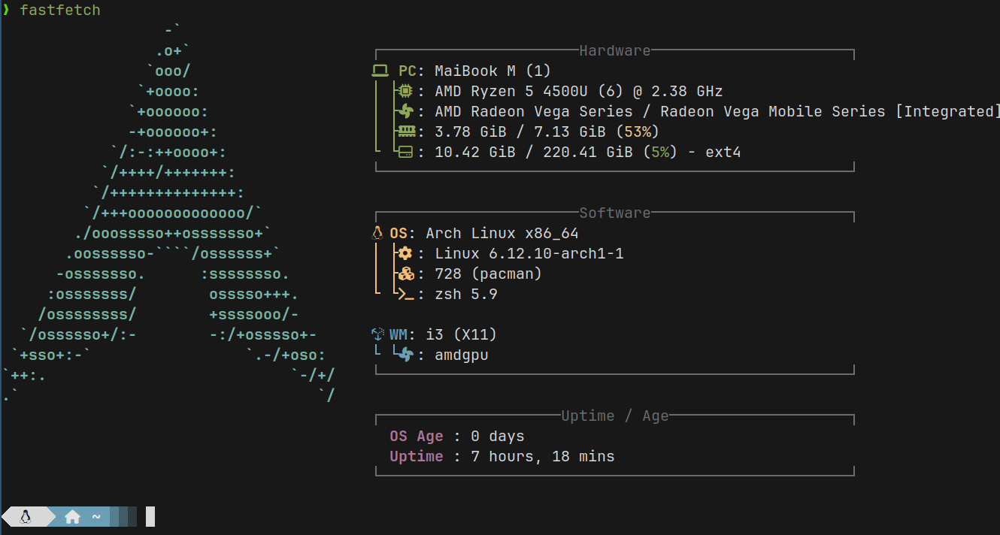

# Overview
<div align="center">
  <h1>🚀 My Dotfiles</h1>
  <p>My personal development environment configuration</p>
  
  
  
  [](LICENSE)
</div>

<div align="center">
  
  <p>Yeah... I use Arch btw! :)<p>
</div>

## 📋 Table of Contents
- [Overview](https://github.com/Binequation/.dotfiles?tab=readme-ov-file#overview-1)
- [Requirements](https://github.com/Binequation/.dotfiles?tab=readme-ov-file#-requirements)
  - [Basic Dependencies](https://github.com/Binequation/.dotfiles?tab=readme-ov-file#basic-dependencies)
  - [Optional Tools](https://github.com/Binequation/.dotfiles?tab=readme-ov-file#optional-tools)
- [Installation](https://github.com/Binequation/.dotfiles?tab=readme-ov-file#-installation)
- [Configuration](#configuration)
  - Neovim
  - Zsh
  - Alacritty
  - i3/i3status
- [Version Managers](https://github.com/Binequation/.dotfiles?tab=readme-ov-file#-version-managers)
  - [Node Version Manager](https://github.com/Binequation/.dotfiles?tab=readme-ov-file#node-version-manager-nvm)
  - [Python Version Manager](https://github.com/Binequation/.dotfiles?tab=readme-ov-file#python-version-manager-pyenv)
  - [Rust Version Manager](https://github.com/Binequation/.dotfiles?tab=readme-ov-file#rust-version-manager-rustup)
- [License](https://github.com/Binequation/.dotfiles?tab=readme-ov-file#-license)

## Overview
<div align="center">
  <table>
    <tr>
      <td align="center">
        <br>
        <sub><b>Neovim</b></sub>
      </td>
      <td align="center">
        <br>
        <sub><b>Alacritty</b></sub>
      </td>
      <td align="center">
        <br>
        <sub><b>Zsh</b></sub>
      </td>
    </tr>
  </table>
</div>

This repository contains my dotfiles. They are aimed at maximum productivity, both in daily routine and in development.
- 🛠 Preconfigured development environment
- 📝 Modern text editing with Neovim
- 🔨 Powerful shell with Zsh
- 🖥 Fast terminal emulator (Alacritty)
- 🪟 Tiling window manager (i3)

## ⚡ Requirements

### Basic Dependencies
- Git
- Curl
- Neovim (>= 0.8.0)
- Zsh
- Alacritty
- i3/i3status

### Optional Tools
- Ripgrep
- fd-find
- Nerd Font

## 🔧 Installation
```bash
# Clone the repository
git clone https://github.com/yourusername/dotfiles.git ~/.dotfiles

# Install requirements
cd ~/.dotfiles
chmod +x install-requirements.sh
./install-requirements.sh

# Create symlinks
./install.sh
```
## Configuration
<details>
<summary><b>Neovim Configuration</b></summary>

* **Plugins:**
    * they will be added later
* **Keybindings:**
    * they're updating rn

* **Theme:**
     * will be added later

* **Other Settings:**  (e.g., autocompletion, linting)
    * will be added later

</details>
<details>
<summary><b>Zsh Configuration</b></summary>

* **Plugins:**
    * [zsh-autosuggestions](https://github.com/zsh-users/zsh-autosuggestions) - Command suggestions
    * [zsh-syntax-highlighting](https://github.com/zsh-users/zsh-syntax-highlighting) - Syntax highlighting

* **Aliases to boost productivity (git aliases is default):**
  * `alias zconf="nvim ~/.zshrc"`  - Fast access to config file
  * `alias zupd="source ~/.zshrc"` - Fast config info update
  * `alias ARCH_UPD="sudo pacman -Syu --noconfirm"` - Full system update
  * `alias PKGS_UPD="yay -Syu --noconfirm"` - Full packages update
  * `alias cls="tput reset"` - Full terminal clearing

* **Theme:**
    * Powerlevel10k

</details>

<details>
<summary><b>Alacritty Configuration</b></summary>

* **Theme:**
    * Default (on rn actually)

* **Font:**
    * JetBrains Mono Nerd Font

* **Keybindings:** 
    * Default (on rn actually)
</details>

<details>
<summary><b>i3/i3status Configuration</b></summary>

* **Workspaces:**
    * 1: Code
    * 2: Terminal
    * 3: Web Browser

* **Keybindings:** (if customized)
    * Will be added later (screensaver, dim screen, volume control)

* **i3status config:**
    * Wifi and Ethernet has a Wifi glyph shows quality and frequency
    * Date and time with special glyphs
    * Volume control
    * Other was smol configured :)

</details>

## 📦 Version Managers

### Node Version Manager (nvm)

```bash
curl -o- https://raw.githubusercontent.com/nvm-sh/nvm/v0.39.1/install.sh | bash
```

## Python Version Manager (pyenv)
```bash
curl https://pyenv.run | bash
```

## Rust Version Manager (rustup)
```bash
curl --proto '=https' --tlsv1.2 -sSf https://sh.rustup.rs | sh
```

## 📄 License

This project is licensed under the MIT License - see the [LICENSE](LICENSE) file fordetails.
